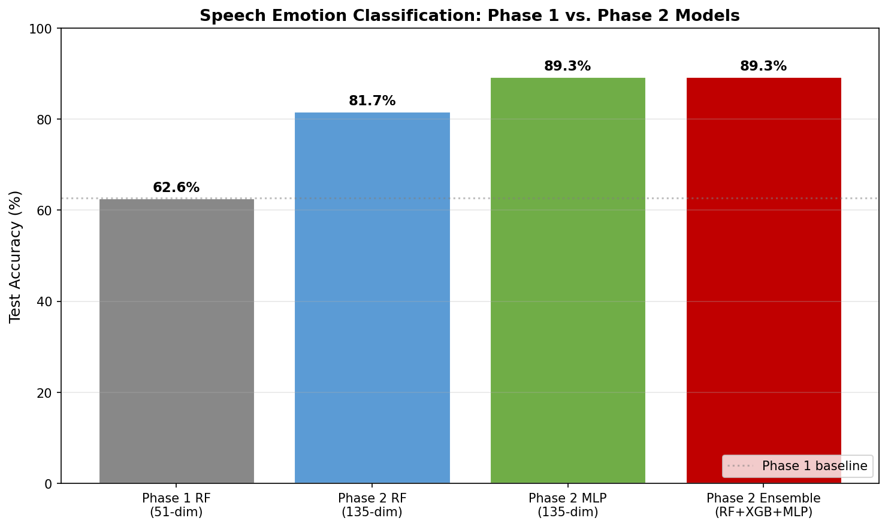
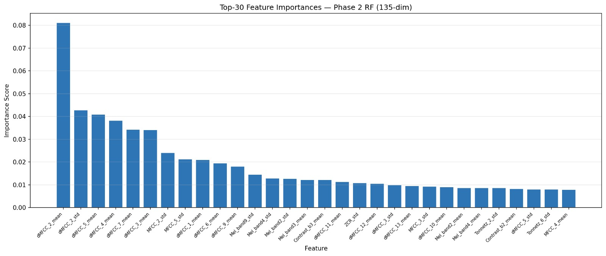

# Speech Emotion Classification

Classifies five emotional states — **Neutral, Happy, Angry, Sad, Surprised** — from short Turkish speech recordings using handcrafted acoustic features and machine-learning classifiers.

This repository contains two iterations of the system, developed for the BIL216 *Emo Challenge 2026* final project:

- **Phase 1** — 51-dim feature set + single RandomForest (baseline)
- **Phase 2** — 135-dim feature set + RF / XGBoost / MLP soft-voting ensemble (research & development)

## Requirements

```
pip install librosa scikit-learn xgboost numpy pandas matplotlib seaborn
```

## Usage

Place the dataset under `Midterm_Dataset_2026/` (one sub-folder per recording group, WAV files inside), then run either script:

```bash
# Phase 1 — baseline (51-dim, RandomForest)
python emotion_classifier.py

# Phase 2 — extended features + ensemble (135-dim, RF + XGB + MLP)
python emotion_classifier_phase2.py
```

## Dataset Format

Filename convention: `G<group>_D<speaker>_<gender>_<age>_<emotion>_C<quality>.wav`

Supported emotion labels (Turkish and English): `Notr/Nötr`, `Mutlu`, `Öfkeli/Ofkeli`, `Üzgün/Uzgun`, `Şaşkın/Saskin`, `Neutral`, `Happy`, `Angry`, `Sad`, `Surprised`, `Furious`, `Shocked`.

---

## Results

| Model | Feature dims | Test Accuracy | Macro-F1 |
|---|---:|---:|---:|
| Phase 1 — RandomForest | 51 | 62.6% | 0.626 |
| Phase 2 — RandomForest (tuned) | 135 | 81.7% | — |
| Phase 2 — MLP (tuned) | 135 | **89.3%** | — |
| **Phase 2 — Soft-Voting Ensemble** | **135** | **89.3%** | **0.891** |



### Phase 2 Per-Class (Ensemble)

| Class | Precision | Recall | F1 |
|---|---:|---:|---:|
| Angry | 0.968 | 0.909 | 0.937 |
| Happy | 0.750 | 0.964 | 0.844 |
| Neutral | 0.968 | 0.857 | 0.909 |
| Sad | 0.889 | 0.941 | 0.914 |
| Surprised | 0.933 | 0.778 | 0.848 |

### Confusion Matrix — Phase 2 Ensemble


### Feature Importance — Phase 2 RF (Top-30)


The most informative features are **Δ-MFCC coefficients** (temporal derivatives of the cepstral envelope, new in Phase 2) and **Mel-spectrogram band statistics**, directly validating the Phase 2 hypothesis that temporal dynamics carry decisive emotional information.

---

## Phase 2 Feature Set (135 dims)

| Group | Dims | Description |
|---|---:|---|
| MFCC mean+std (13 coeff.) | 26 | Static spectral envelope |
| STE, ZCR | 3 | Energy & noisiness (time-domain) |
| F0 (autocorrelation) | 2 | Pitch / prosody |
| Spectral Centroid / BW / Rolloff | 6 | Brightness & spread |
| Spectral Contrast (7 bands) | 14 | Peak-valley contrast |
| **Δ-MFCC mean+std** | 26 | First-order temporal derivative *(new)* |
| **Chroma STFT (12 bins)** | 24 | Tonal / harmonic profile *(new)* |
| **Spectral Flatness** | 2 | Tonal-vs-noise ratio *(new)* |
| **Mel-Spec band statistics (10 bands)** | 20 | Perceptual frequency envelope *(new)* |
| **Tonnetz** | 12 | Harmonic centroid *(new)* |
| **Total** | **135** | |

## Phase 2 Models

- **RandomForest** — 300 trees, depth 20, balanced class weight; interpretable feature importances.
- **XGBoost** — gradient boosting (300 rounds, depth 6, lr 0.1); handles feature collinearity well.
- **MLP** — fully-connected (256 → 128 → 64), ReLU, Adam, L2 regularisation.
- **Soft-Voting Ensemble** — averages `predict_proba` of the three base learners and takes argmax.

All three base learners are independently tuned with `RandomizedSearchCV` (20 / 20 / 15 iterations, 3-fold CV).

---

## Reports

- [`FinalProject_GROUP9_Phase1.md`](FinalProject_GROUP9_Phase1.md) / [`.pdf`](FinalProject_GROUP9_Phase1.pdf)
- [`FinalProject_GROUP9_Phase2.md`](FinalProject_GROUP9_Phase2.md) / `.pdf` (generated from the Markdown source)

## Group 9

Ahmet Akin · Berivan Demir · Mustafa Talha Akgul
BIL216 — Istanbul University, 2025–2026 Spring
