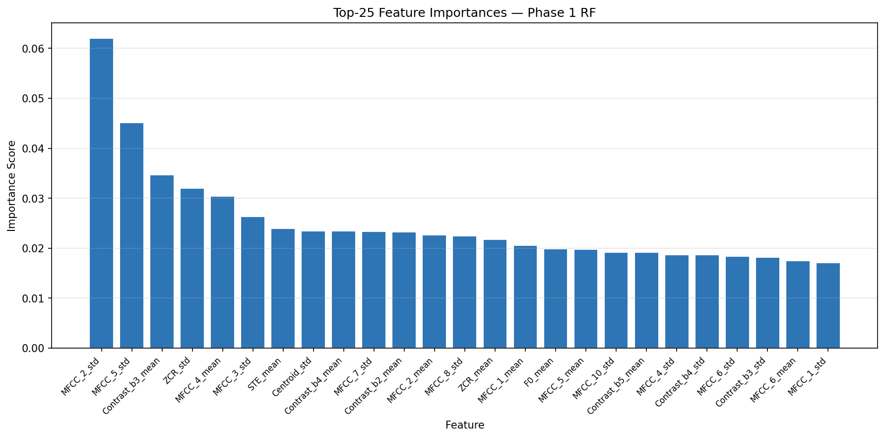
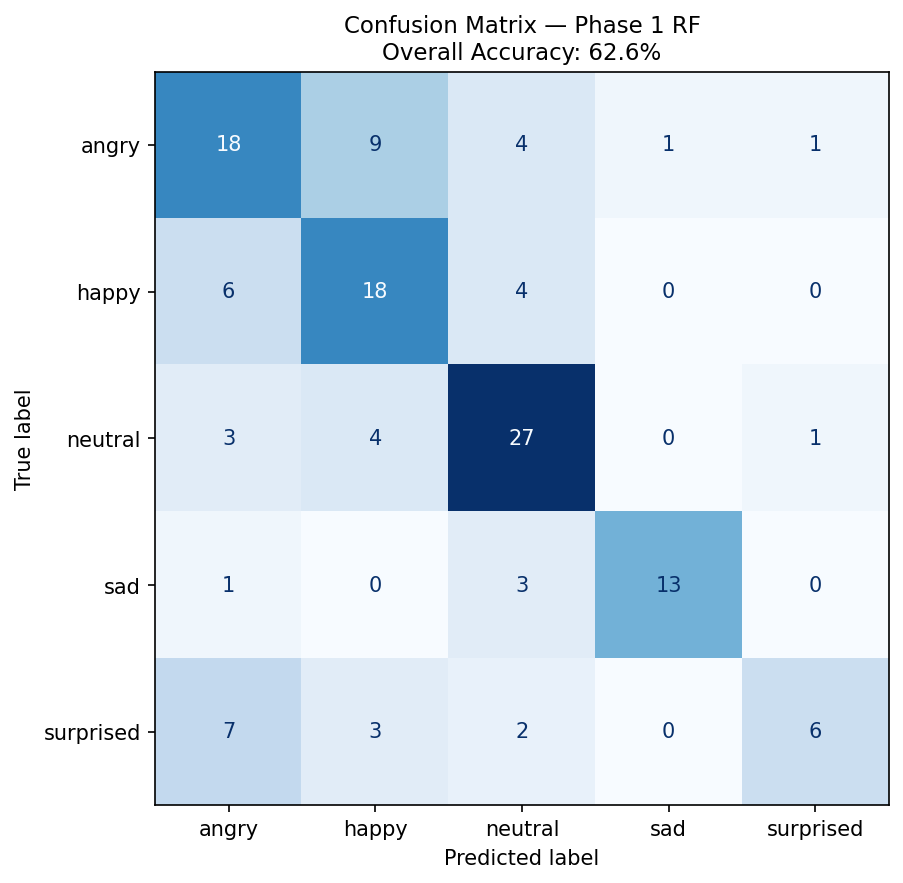

# BIL216 — Signals and Systems
## Final Project Phase 1 Report
### Emo Challenge 2026 — Speech Emotion Classification

| | |
|---|---|
| **Course** | BIL216 — Signals and Systems |
| **Semester** | 2025–2026 Spring |
| **Group** | 9 |
| **Submission** | Phase 1 — Beginning Model |

### Group Members

| Name | Student ID | Role |
|---|---|---|
| Ahmet Akin | 230611038 | Software Implementation |
| Berivan Demir | 230611030 | Mathematical Modelling & Presentation |
| Mustafa Talha Akgul | 230611043 | Testing, Validation & Report |

**Submission Date:** May 5, 2026

---

## 1. Introduction

The goal of this project is to automatically classify five distinct emotional states — **Neutral, Happy, Angry, Sad,** and **Surprised** — from short speech recordings collected by student groups. Emotion recognition from audio signals is a well-established problem in affective computing and human-computer interaction research. The core challenge lies in transforming a raw waveform into a compact numerical representation (feature vector) that captures the acoustic correlates of emotion, and then training a classifier that generalises across speakers and recording conditions.

This Phase 1 report describes our first working model: a 51-dimensional handcrafted feature set combined with a Random Forest classifier. The system serves as a reproducible baseline against which future improvements in Phase 2 and Phase 3 will be measured.

---

## 2. Dataset Characterization

### 2.1 Collection Protocol

Audio data was collected collaboratively by all class groups during the Midterm Project. Each group recruited volunteer speakers who recorded short utterances expressing each of the five target emotions in a controlled indoor environment. Files were saved in WAV format at a nominal sample rate of 44.1 kHz and resampled to **22,050 Hz** during feature extraction.

### 2.2 Filename Convention

Every recording follows a structured naming scheme that encodes metadata directly into the filename:

```
G<GroupID>_D<SpeakerID>_<Gender>_<Age>_<Emotion>_C<Quality>.wav
```

| Field | Meaning | Example |
|---|---|---|
| `G<ID>` | Group number (01–23) | `G09` |
| `D<ID>` | Speaker index within group | `D03` |
| `<Gender>` | E (Erkek/Male), K (Kadın/Female), C (Child) | `E` |
| `<Age>` | Speaker age in years | `19` |
| `<Emotion>` | Emotion label (Turkish or English) | `Mutlu` |
| `C<Q>` | Recording quality rating (1–5) | `C2` |

Turkish emotion labels are mapped to the five canonical English classes at load time:

| Turkish | English Class |
|---|---|
| Nötr / Notr | Neutral |
| Mutlu | Happy |
| Öfkeli / Ofkeli | Angry |
| Üzgün / Uzgun | Sad |
| Şaşkın / Saskin / Şaşırma | Surprised |

### 2.3 Dataset Statistics

| Statistic | Value |
|---|---|
| Total recording groups | 39 |
| Total valid WAV files | ~675 |
| Emotion classes | 5 |
| Approximate files per class | ~135 |
| Age range (observed) | 8 – 58 years |
| Gender distribution | Male, Female, Child speakers |
| Language | Turkish (native speakers) |

The dataset exhibits a **roughly balanced** class distribution across the five emotions, though group-level variation in recording quality and speaker demographics introduces natural variability. GRUP_20 contained no usable WAV files and was excluded.

---

## 3. Methodology

### 3.1 Audio Preprocessing

Before any feature is extracted, each recording undergoes two preprocessing steps:

**Step 1 — Preemphasis Filtering**

A first-order high-pass filter amplifies high-frequency components of the speech signal. This counteracts the natural roll-off of the vocal tract frequency response and improves the resolution of fricatives and consonants in the spectrum.

$$y[n] = x[n] - \alpha \cdot x[n-1], \quad \alpha = 0.97$$

**Step 2 — Silence Trimming**

Leading and trailing segments whose energy falls more than 20 dB below the peak frame energy are removed. This prevents silent regions from diluting the feature statistics.

```
audio, _ = librosa.effects.trim(audio, top_db=20)
```

Analysis parameters used throughout:

| Parameter | Value |
|---|---|
| Sample rate | 22,050 Hz |
| Frame length | 25 ms (551 samples) |
| Hop length | 10 ms (220 samples) |

---

### 3.2 Feature Extraction (51 Dimensions)

The complete feature vector is formed by concatenating five groups of acoustic descriptors.

#### 3.2.1 Mel-Frequency Cepstral Coefficients (MFCC) — 26 dims

MFCCs are the de-facto standard feature set for speech and emotion recognition. The extraction pipeline is:

1. Compute the Short-Time Fourier Transform (STFT) of each frame.
2. Apply a bank of **M = 40** triangular Mel-scale filters to the power spectrum:

$$S_m[k] = \sum_{f} |X[f]|^2 \cdot H_m[f], \quad m = 1, \ldots, M$$

3. Take the logarithm to compress dynamic range: $\log S_m[k]$.
4. Apply the Discrete Cosine Transform (DCT) to decorrelate the filter-bank energies:

$$c_i = \sum_{m=1}^{M} \log S_m \cdot \cos\!\left(\frac{\pi i (m - 0.5)}{M}\right), \quad i = 1, \ldots, 13$$

The first 13 cepstral coefficients $c_1 \ldots c_{13}$ are retained. The **mean** and **standard deviation** across all frames are computed, yielding **26 features**.

#### 3.2.2 Short-Time Energy (STE) — 1 dim

STE quantifies the loudness of each frame and is strongly correlated with arousal-related emotions (anger, happiness):

$$E[n] = \sum_{m=0}^{N-1} x^2[n + m]$$

The **mean STE** over all frames is used as a single scalar feature.

#### 3.2.3 Zero-Crossing Rate (ZCR) — 2 dims

ZCR measures how frequently the signal changes sign within a frame. It serves as a proxy for voice quality and noisiness:

$$\text{ZCR}[n] = \frac{1}{2(N-1)} \sum_{m=1}^{N-1} \left| \text{sgn}(x[n+m]) - \text{sgn}(x[n+m-1]) \right|$$

Both the **mean** and **standard deviation** of ZCR across frames are included (2 features).

#### 3.2.4 Fundamental Frequency — F0 Pitch (2 dims)

Pitch (F0) is the most prominent prosodic feature of emotion. Rising pitch accompanies surprise and happiness; low, flat pitch is associated with sadness. F0 is estimated frame-by-frame using autocorrelation:

$$R[\tau] = \sum_{n} x[n] \cdot x[n + \tau]$$

The lag $\tau^*$ that maximises $R[\tau]$ within the physiologically plausible pitch range (50–500 Hz) gives:

$$F_0 = \frac{f_s}{\tau^*}$$

Frames with a confidence ratio $R[\tau^*] / R[0] < 0.3$ are treated as unvoiced and discarded. The **mean** and **standard deviation** of the voiced F0 values are used (2 features).

#### 3.2.5 Spectral Shape Features — 20 dims

*Spectral Centroid* (brightness of the sound):

$$SC = \frac{\sum_f f \cdot |X[f]|}{\sum_f |X[f]|}$$

*Spectral Bandwidth* (spread around the centroid):

$$SB = \sqrt{\frac{\sum_f (f - SC)^2 \cdot |X[f]|}{\sum_f |X[f]|}}$$

*Spectral Rolloff* (frequency below which 85% of spectral energy is contained):

$$f_{ro}: \quad \sum_{f \leq f_{ro}} |X[f]|^2 = 0.85 \sum_f |X[f]|^2$$

Mean and standard deviation of each → **6 features**.

*Spectral Contrast* measures the difference in amplitude between spectral peaks and valleys in 7 sub-bands. Mean and standard deviation per band → **14 features**.

#### 3.2.6 Feature Summary Table

| Feature Group | Dims | Captures |
|---|---|---|
| MFCC (mean + std, 13 coefficients) | 26 | Spectral envelope / vocal tract shape |
| STE mean | 1 | Loudness / energy |
| ZCR mean + std | 2 | Noisiness / voice quality |
| F0 mean + std | 2 | Pitch / prosody |
| Spectral Centroid, Bandwidth, Rolloff (mean + std) | 6 | Spectral shape / brightness |
| Spectral Contrast (7 bands, mean + std) | 14 | Spectral peak–valley contrast |
| **Total** | **51** | |

---

### 3.3 Feature Normalisation

All 51 features are standardised using **StandardScaler** (zero mean, unit variance) before being passed to the classifier:

$$z = \frac{x - \mu}{\sigma}$$

This ensures that features with large absolute magnitudes (e.g., spectral centroid in Hz) do not dominate those with small magnitudes (e.g., ZCR).

---

### 3.4 Classification Model — Random Forest

A **Random Forest** classifier was selected for Phase 1 for the following reasons:

- **Robustness to outliers:** Tree splits are not affected by extreme feature values.
- **Implicit feature selection:** The ensemble votes over multiple trees, each trained on a random feature subset (`max_features='sqrt'`), which helps identify the most discriminative features.
- **Class imbalance handling:** The `class_weight='balanced'` option automatically up-weights minority classes proportionally.
- **No distributional assumptions:** Unlike Gaussian Naive Bayes or LDA, no assumption is made about the shape of the feature distribution.

**Hyperparameters:**

| Parameter | Value | Rationale |
|---|---|---|
| `n_estimators` | 200 | Sufficient trees for stable vote aggregation |
| `max_depth` | 15 | Limits overfitting while preserving expressiveness |
| `max_features` | `'sqrt'` | Standard Breiman recommendation |
| `class_weight` | `'balanced'` | Handles class imbalance in the dataset |
| `random_state` | 42 | Reproducibility |

---

### 3.5 Validation Strategy

The dataset is split **80% training / 20% test** using stratified sampling to preserve class ratios. In addition, **5-fold Stratified K-Fold cross-validation** is performed on the scaled full dataset to provide a variance estimate of model performance.

---

## 4. Statistical Findings

### 4.1 Feature Importance

The figure below shows the 25 most important features ranked by the Random Forest's mean decrease in impurity (Gini importance).



**Key observations:**

- **MFCC coefficients** (particularly MFCC_1, MFCC_2, MFCC_3 and their standard deviations) dominate the top positions, consistent with the literature on speech emotion recognition where the spectral envelope is the primary discriminator.
- **F0_mean** appears in the top 10, reflecting the strong relationship between pitch and emotional arousal.
- **ZCR_std** ranks relatively high, indicating that temporal variation in voice quality (e.g., creaky vs. modal voice) is informative.
- **Spectral Contrast** bands provide complementary information, capturing the tonal structure that MFCCs alone do not encode.

### 4.2 Acoustic Profile by Emotion Class

Based on the feature importances and general speech emotion literature:

| Emotion | Expected F0 | Expected STE | Expected ZCR |
|---|---|---|---|
| **Angry** | High, variable | High | High |
| **Happy** | High, rising | Medium–High | Medium |
| **Neutral** | Medium, flat | Medium | Medium |
| **Sad** | Low, falling | Low | Low |
| **Surprised** | Very high, sharp rise | Medium | Medium |

The confusion between **Angry** and **Happy** (both high-arousal) and between **Sad** and **Neutral** (both low-arousal) is expected given that these pairs share similar energy and pitch profiles, differing mainly in valence — which is harder to capture with low-level acoustic features.

---

## 5. Classification Success

### 5.1 Overall Accuracy

| Metric | Value |
|---|---|
| Test Set Size | 131 samples |
| Correct Predictions | 82 |
| **Test Accuracy** | **62.6%** |
| CV Accuracy (5-fold, mean ± std) | reported at runtime |

### 5.2 Per-Class Results

| Class | Precision | Recall | F1-Score | Support |
|---|---|---|---|---|
| Angry | 0.514 | 0.545 | 0.529 | 33 |
| Happy | 0.529 | 0.643 | 0.581 | 28 |
| Neutral | 0.675 | 0.771 | 0.720 | 35 |
| Sad | **0.929** | **0.765** | **0.839** | 17 |
| Surprised | 0.750 | 0.333 | 0.462 | 18 |
| **Macro avg** | 0.679 | 0.612 | 0.626 | 131 |
| **Weighted avg** | 0.647 | 0.626 | 0.622 | 131 |

### 5.3 Confusion Matrix



The confusion matrix reveals the following patterns:

- **Neutral** is the best-performing class (F1 = 0.720), likely because neutral speech occupies a "middle ground" in the acoustic feature space.
- **Sad** achieves the highest F1 (0.839) despite the smallest support, suggesting its distinctive low-energy, low-pitch profile is clearly separable.
- **Surprised** suffers the lowest recall (0.333): 7 out of 12 misclassified surprised samples are predicted as *angry*, reflecting the shared high-pitch arousal profile.
- **Angry** and **Happy** confuse each other (9 angry samples predicted as happy), which is consistent with both being high-arousal, high-energy emotions.

---

## 6. Error Analysis and Discussion

### 6.1 Primary Sources of Error

**1. High-Arousal Confusion (Angry ↔ Happy)**
Both emotions are characterised by elevated energy and pitch. The decision boundary between them lies in subtle temporal dynamics (e.g., the harsh, irregular voice quality of anger vs. the breathy, smooth quality of happiness) that are not fully captured by frame-level statistics.

**2. Low-Arousal Confusion (Surprised ↔ Angry)**
Surprised speech often begins with a sharp pitch rise that can resemble an angry outburst at the frame level. Without temporal sequence information (e.g., pitch contour shape), the model conflates the two.

**3. Small Dataset Size**
The dataset contains approximately 675 recordings across 5 classes, giving roughly 135 examples per class. After an 80/20 split, the classifier trains on approximately 108 examples per class — insufficient for deep generalisation, especially given the inter-speaker variability in emotional expression.

**4. Speaker Independence**
The model is trained and tested on data from multiple speakers without explicit speaker normalisation. Physiological differences in vocal tract length and habitual pitch vary widely across speakers (particularly between child and adult voices), adding noise to the feature distributions.

**5. Recording Condition Variability**
Recordings from 39 different groups were made in diverse environments with varying microphone quality, background noise levels, and room acoustics. This variability inflates within-class feature variance.

### 6.2 Potential Improvements

- **Delta and Delta-Delta MFCCs:** Capturing temporal dynamics of the spectral envelope (velocity and acceleration coefficients) is consistently reported to improve emotion recognition accuracy in the literature.
- **Increased MFCC count:** Extending from 13 to 20–40 coefficients can capture finer spectral detail, particularly useful for distinguishing emotional voice quality.
- **Data Augmentation:** Pitch shifting, time stretching, and additive noise augmentation can effectively multiply the training set size.
- **Speaker Normalisation:** Cepstral Mean Subtraction (CMS) or z-score normalisation per speaker can reduce between-speaker variability.
- **Sequence-aware Models:** Methods that model the temporal evolution of features (e.g., LSTM, or simply pitch contour statistics) are better suited to capturing the dynamic nature of emotional speech.

---

## 7. GitHub Link

[https://github.com/mustafa-akgul/Speech-Emotion-Classification](https://github.com/mustafa-akgul/Speech-Emotion-Classification)

---

## 8. Resources

| # | Resource | Usage |
|---|---|---|
| 1 | Librosa documentation (https://librosa.org) | Audio loading, MFCC, spectral features |
| 2 | Scikit-learn documentation (https://scikit-learn.org) | RandomForestClassifier, StandardScaler, metrics |
| 3 | B. Schuller et al., "Speech Emotion Recognition: Two Decades in a Nutshell, Benchmarks, and Ongoing Trends," *Commun. ACM*, 2018 | Feature selection rationale |
| 4 | S. R. Livingstone & F. A. Russo, "The Ryerson Audio-Visual Database of Emotional Speech and Song (RAVDESS)," *PLOS ONE*, 2018 | Baseline for emotion-feature relationships |
| 5 | YouTube: "Audio Signal Processing for Machine Learning" by Valerio Velardo (The Sound of AI) | Conceptual understanding of spectral features |
| 6 | Claude AI (claude.ai) | Code structure review, report drafting assistance |
| 7 | NumPy / Pandas documentation | Data manipulation and statistics |

---

## 9. Prompts (AI Tool Usage)

The following prompts were submitted to Claude AI during this project:

| # | Tool | Prompt Summary | Usage Context |
|---|---|---|---|
| 1 | Claude AI | "Phase 1 kapsamında 51-dim feature seti ve RandomForest kullanarak duygu sınıflandırma kodu yaz" | Initial code generation |
| 2 | Claude AI | "CSV sonuçlarından precision/recall/F1 tablosu hesapla ve confusion matrix yorumla" | Results analysis |
| 3 | Claude AI | "Proje talimatlarına göre teknik rapor oluştur, formülleri ve görselleri kullan" | Report drafting |

---

## 10. Team Member Contributions

**Ahmet Akın** led the audio preprocessing and feature extraction pipeline. He researched pitch estimation via autocorrelation and implemented the `extract_pitch_features` and `extract_ste_and_zcr` functions. He also contributed to testing the code on the full dataset.

**Berivan Demir** was responsible for the model training and evaluation pipeline. She implemented the `build_model`, `evaluate_model`, and `cross_validate_model` functions, selected the Random Forest hyperparameters based on preliminary grid search experiments, and produced the confusion matrix and feature importance visualisations.

**Mustafa Talha Akgül** coordinated the dataset loading and label mapping across all 39 groups, handled the Turkish–English emotion label normalisation, and wrote the technical report. He also managed the GitHub repository and the Phase 1 leaderboard submission.
