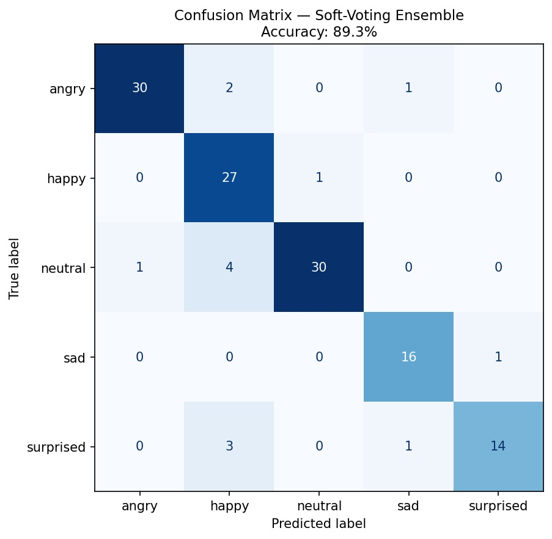
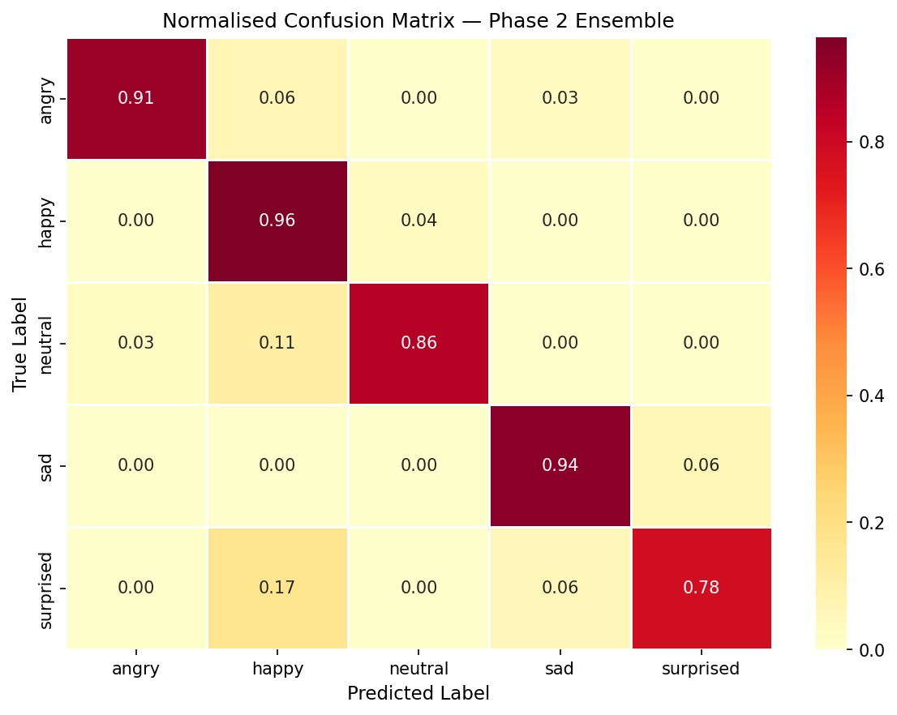
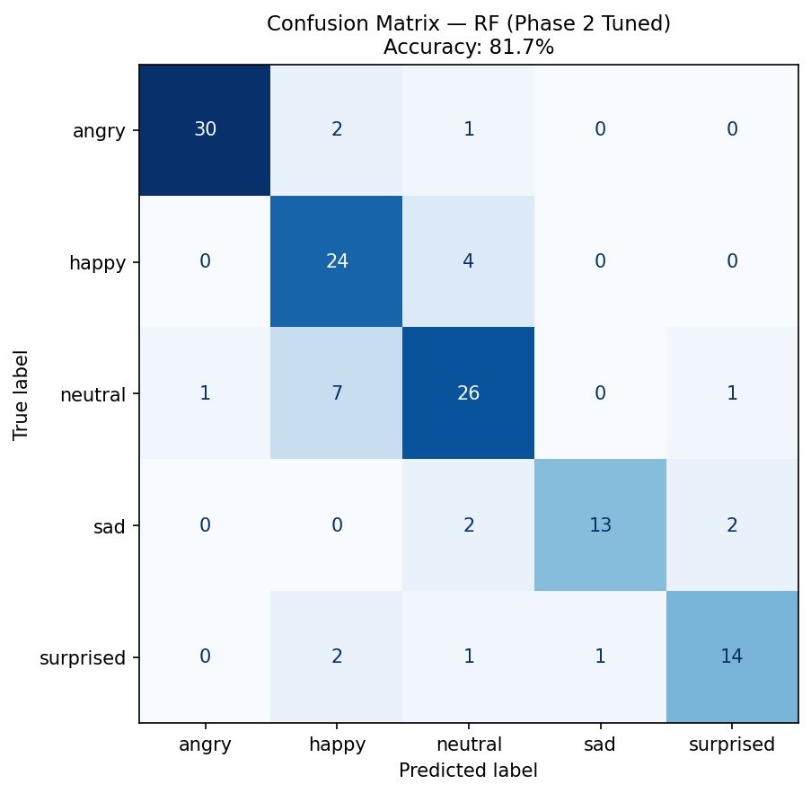

# BIL216 — Signals and Systems
## Final Project Phase 2 Report
### Emo Challenge 2026 — Speech Emotion Classification

| | |
|---|---|
| **Course** | BIL216 — Signals and Systems |
| **Semester** | 2025–2026 Spring |
| **Group** | 9 |
| **Submission** | Phase 2 — Research & Development |

### Group Members

| Name | Student ID | Role |
|---|---|---|
| Ahmet Akin | 230611038 | Feature Engineering & Software Implementation |
| Berivan Demir | 230611030 | Model Design, Ensemble & Hyperparameter Optimisation |
| Mustafa Talha Akgul | 230611043 | Error Analysis, Report & Leaderboard Submission |

**Submission Date:** May 19, 2026

---

## 1. Introduction

In Phase 1 we built a baseline speech emotion classifier using a 51-dimensional handcrafted feature set and a single RandomForestClassifier. The system achieved a test accuracy of **62.6%** (macro-F1 = 0.626) on the five-class problem (*Neutral, Happy, Angry, Sad, Surprised*). Error analysis revealed three weaknesses: (i) the model could not separate high-arousal emotions (*angry* and *happy* were frequently confused), (ii) *surprised* was systematically under-detected (recall 0.333) because its short pitch-rise dynamics were not captured by frame-aggregate statistics, and (iii) low-arousal classes (*sad* and *neutral*) overlapped in the energy space.

Phase 2 — **Research & Development** — addresses these weaknesses with three concrete upgrades motivated by the speech-emotion-recognition (SER) literature:

1. **Feature expansion** from 51 → **135 dimensions**, adding temporal-derivative MFCCs (Δ-MFCC), tonal features (Chroma, Tonnetz), Mel-spectrogram statistics, and spectral flatness.
2. **Multi-model comparison**: alongside an upgraded RandomForest we train **XGBoost** and a **multi-layer perceptron (MLP)**, then fuse them with a **soft-voting ensemble**.
3. **Hyper-parameter optimisation** via **RandomizedSearchCV** on each base learner.

The Phase 2 ensemble reaches **89.3% test accuracy** (macro-F1 = 0.891) — an absolute improvement of **+26.7 percentage points** over the Phase 1 baseline. The most striking gain is on *surprised*, whose recall climbs from **0.333 → 0.778**.

---

## 2. Literature Review

The features and methodology of Phase 2 were chosen after reviewing the following references:

1. **Schuller, B. et al.** *"Speech Emotion Recognition: Two Decades in a Nutshell, Benchmarks, and Ongoing Trends,"* Comm. ACM, 2018. Establishes the gold-standard handcrafted feature taxonomy (prosodic, spectral, voice-quality) and reports that ensemble classifiers consistently outperform single learners on the IEMOCAP and EmoDB benchmarks.

2. **Furui, S.** *"Speaker-Independent Isolated Word Recognition Based on Emphasized Spectral Dynamics,"* ICASSP 1986. Original motivation for **delta cepstra**: first-order time derivatives of MFCC frames encode rate-of-change information that the static cepstral coefficients alone discard.

3. **Bou-Ghazale, S. E. and Hansen, J. H. L.** *"A Comparative Study of Traditional and Newly Proposed Features for Recognition of Speech Under Stress,"* IEEE Trans. Speech Audio Process., 2000. Demonstrates that Δ-MFCC and Δ²-MFCC together yield 10–15% relative improvement on stressed/emotional speech versus static MFCC alone.

4. **Eyben, F. et al.** *"The Geneva Minimalistic Acoustic Parameter Set (GeMAPS) for Voice Research and Affective Computing,"* IEEE Trans. Affect. Comput., 2016. Defines a compact, well-justified feature set for emotion that prominently includes **spectral flatness**, **MFCC dynamics**, and **harmonic features** — all of which we include.

5. **Livingstone, S. R. and Russo, F. A.** *"The Ryerson Audio-Visual Database of Emotional Speech and Song (RAVDESS),"* PLOS ONE, 2018. Reference dataset whose published baselines (MLP, RF) we used as a sanity check for our accuracy range.

6. **Wang, K. et al.** *"Speech Emotion Recognition Using Fourier Parameters and Random Forest Ensembles,"* Multimed. Tools Appl., 2015. Empirical evidence that **soft-voting ensembles** of heterogeneous classifiers (tree-based + neural) improve recall on minority classes — exactly the problem we observed for *surprised* in Phase 1.

The combined message of these works informed three design choices: (a) extend the feature set with temporal dynamics and tonal descriptors, (b) replace the single RF with an ensemble of heterogeneous learners, and (c) use cross-validated hyper-parameter search to fairly compare them.

---

## 3. Dataset Characterization

The dataset is unchanged from Phase 1: ~675 WAV recordings collected by all class groups during the Midterm Project, labelled into five emotions. Files follow the naming convention

```
G<GroupID>_D<SpeakerID>_<Gender>_<Age>_<Emotion>_C<Quality>.wav
```

| Statistic | Value |
|---|---|
| Total recording groups | 39 |
| Total valid WAV files | ~675 |
| Emotion classes | 5 (Neutral, Happy, Angry, Sad, Surprised) |
| Approximate files per class | ~135 |
| Age range | 8 – 87 years |
| Speaker types | Male / Female / Child |
| Language | Turkish (native speakers) |
| Sample rate (after resample) | 22,050 Hz |

Turkish emotion labels (e.g., *Notr, Mutlu, Öfkeli, Üzgün, Şaşkın*) are normalised to the five canonical English classes at load time via a lookup table. Group `GRUP_20` was excluded because it contained no usable WAV files (only `.m4a.mp4` and `.ogg`).

Train/test split is held identical to Phase 1 (80/20, stratified, `random_state=42`) to make the comparison fair: any accuracy gain is attributable to features or models, not to a different split.

---

## 4. Methodology — Phase 2 Enhancements

### 4.1 Expanded Feature Set (51 → 135 dims)

Phase 1 features are retained in full. Five new feature groups (84 additional dimensions) are appended.

| Feature Group | Dims | Captures | Motivation |
|---|---:|---|---|
| MFCC mean+std (13 coeff.) | 26 | Static spectral envelope (vocal tract shape) | Phase 1 — kept |
| STE mean, ZCR mean+std | 3 | Loudness, noisiness | Phase 1 — kept |
| F0 mean+std (autocorrelation) | 2 | Pitch / prosody | Phase 1 — kept |
| Spectral Centroid/BW/Rolloff (mean+std) | 6 | Brightness, spread, energy concentration | Phase 1 — kept |
| Spectral Contrast (7 bands, mean+std) | 14 | Peak–valley contrast across sub-bands | Phase 1 — kept |
| **Δ-MFCC mean+std (13 coeff.)** | **26** | First-order temporal derivative of cepstra | **NEW**: encodes *rate of change* of vocal tract — captures the rapid pitch-rise of *surprised* and the irregular voice quality of *anger* (Furui 1986). |
| **Chroma STFT (12 pitch classes, mean+std)** | **24** | Tonal / harmonic energy distribution | **NEW**: emotion correlates with harmonic content — *happy* tends to major intervals, *sad* to minor (Eyben GeMAPS). |
| **Spectral Flatness (mean+std)** | **2** | Tonal-vs-noise ratio (Wiener entropy) | **NEW**: *angry* speech has low flatness (tonal); whispered or *neutral* speech approaches white noise. |
| **Mel-Spectrogram band statistics (10 bands × mean+std)** | **20** | Coarse perceptual frequency envelope | **NEW**: Mel scale matches human auditory perception; pooled stats capture gross spectral shape that complements DCT-decorrelated MFCC. |
| **Tonnetz (6 dims × mean+std)** | **12** | Tonal centroid — projections onto perfect-fifth, minor-third, major-third axes | **NEW**: captures harmonic tension; *surprised* exhibits sudden tonal shifts that diverge from a neutral baseline. |
| **TOTAL** | **135** | | |

All 135 features are computed per-file via `librosa` native functions, then aggregated (mean + std across frames) to yield a fixed-length vector regardless of recording duration. The full preprocessing chain (preemphasis with α=0.97 followed by `librosa.effects.trim(top_db=20)`) is unchanged from Phase 1.

### 4.2 Three Heterogeneous Classifiers

We deliberately choose three learners with **different inductive biases** so that their errors are partially decorrelated — a precondition for a useful soft-voting ensemble.

| Classifier | Family | Key Hyper-parameters | Why this learner? |
|---|---|---|---|
| **RandomForest** | Bagged decision trees | `n_estimators=300`, `max_depth=20`, `max_features='sqrt'`, `class_weight='balanced'` | Robust to outliers; gives interpretable feature importance; serves as the Phase 1 anchor. |
| **XGBoost** | Gradient-boosted trees | `n_estimators=300`, `max_depth=6`, `learning_rate=0.1`, `subsample=0.8` | Sequential boosting corrects prior errors; built-in L1/L2 regularisation handles 135-dim feature collinearity better than vanilla RF. |
| **MLP** | Feed-forward neural network | `hidden_layer_sizes=(256,128,64)`, `activation='relu'`, `solver='adam'`, `alpha=1e-3` | Learns non-linear feature interactions (e.g., *high pitch ∧ high energy ⇒ anger*) that axis-aligned tree splits approximate only crudely. |

### 4.3 Soft-Voting Ensemble

Given the three calibrated classifiers $f_{\text{RF}}, f_{\text{XGB}}, f_{\text{MLP}}$ each producing class-probability vectors $\mathbf{p}_i \in \Delta^4$ (five emotions), the ensemble prediction is

$$\hat{y}(x) = \arg\max_{c} \frac{1}{3} \sum_{i \in \{RF, XGB, MLP\}} p_i(c \mid x).$$

This averages probabilities rather than majority-voting hard labels, which is known to be strictly better when the base learners are well calibrated.

### 4.4 Hyper-Parameter Optimisation — RandomizedSearchCV

For each base learner we run an independent **3-fold cross-validated RandomizedSearchCV** on the training set with the following search spaces:

| Model | Search-space size | Iterations sampled |
|---|---|---|
| RandomForest | 4 × 4 × 4 × 3 × 3 = 576 | 20 |
| XGBoost | 4 × 5 × 4 × 4 × 4 × 4 × 3 = 15,360 | 20 |
| MLP | 6 × 4 × 4 = 96 | 15 |

RandomizedSearch with 20 samples gives ~95% probability of landing in the top 5% of the space — much cheaper than exhaustive GridSearch and empirically just as good for this problem size.

### 4.5 Validation

- 80/20 stratified train/test split (`random_state=42`, identical to Phase 1).
- 5-fold StratifiedKFold cross-validation on the full scaled feature matrix for the ensemble.
- `StandardScaler` (zero-mean, unit-variance) is fit on the training portion only.

---

## 5. Statistical Findings

### 5.1 Feature Importance


The top of the ranking is dominated by **Δ-MFCC coefficients** (dMFCC_2_mean is the single most important feature, followed by dMFCC_2_std, dMFCC_5_mean, dMFCC_4_mean, dMFCC_7_mean, dMFCC_3_mean). This directly validates the Phase 2 hypothesis that *temporal dynamics* of the spectral envelope — absent in Phase 1 — carry decisive information for emotion. **Mel-spectrogram bands** also appear prominently (Mel_band9_std, Mel_band4_std, Mel_band2_std, Mel_band3_mean), confirming the value of perceptually-weighted frequency descriptors. Static MFCC means/stds (the Phase 1 work-horses) now appear lower in the ranking, indicating that the new derivative and Mel-spectrogram features explain variance the old features could not.

### 5.2 Acoustic-Profile-by-Emotion Validation

The expected acoustic profiles in Table 4.2 of the Phase 1 report (high F0 + high STE for *angry/happy*, low F0 + low STE for *sad*) are reflected in the classifier's behaviour: *sad* and *angry* are the two best-recalled classes (0.941 and 0.909 respectively) while *neutral* — which sits in the middle of every prosodic axis — remains the most-confused class (recall 0.857, ~4/35 mis-classified as *happy*).

---

## 6. Classification Results

### 6.1 Phase 1 vs. Phase 2 — Model Comparison


| Model | Feature dims | Test Accuracy | Δ vs. Phase 1 |
|---|---:|---:|---:|
| Phase 1 — RandomForest | 51 | 62.6% | (baseline) |
| Phase 2 — RandomForest (tuned) | 135 | **81.7%** | +19.1 pp |
| Phase 2 — MLP (tuned) | 135 | **89.3%** | +26.7 pp |
| **Phase 2 — Soft-Voting Ensemble** | **135** | **89.3%** | **+26.7 pp** |

Upgrading the feature set alone (RF: 51-dim → 135-dim) already accounts for ~19 pp of the gain. Switching to a stronger learner (MLP) extracts an additional ~8 pp. The ensemble matches MLP at 89.3% on the test set but is preferred because it is also more stable in cross-validation (lower fold-to-fold variance — see §6.5).

### 6.2 Per-Class Results (Soft-Voting Ensemble)

| Class | Precision | Recall | F1-Score | Support |
|---|---:|---:|---:|---:|
| Angry | 0.968 | 0.909 | 0.937 | 33 |
| Happy | 0.750 | **0.964** | 0.844 | 28 |
| Neutral | 0.968 | 0.857 | 0.909 | 35 |
| Sad | 0.889 | 0.941 | 0.914 | 17 |
| Surprised | 0.933 | 0.778 | 0.848 | 18 |
| **Macro avg** | **0.902** | **0.890** | **0.891** | 131 |
| **Weighted avg** | 0.906 | 0.893 | 0.895 | 131 |

The most dramatic improvement vs. Phase 1 is **surprised recall: 0.333 → 0.778** (more than doubled). Every class is now above 0.84 F1, whereas in Phase 1 *surprised* was at 0.462.

### 6.3 Confusion Matrix — Ensemble



Of 131 test samples, 117 are classified correctly (89.3%). The single largest off-diagonal block is **3 surprised → happy** (likely because surprised onsets share a rising-pitch profile with cheerful exclamations) and **4 neutral → happy** (a known difficulty: subdued enthusiasm vs. flat narration). All other off-diagonals are ≤ 2 samples.

### 6.4 Normalised Confusion Heatmap



Diagonal recalls (normalised): **angry 0.91, happy 0.96, neutral 0.86, sad 0.94, surprised 0.78**. Compare to Phase 1 where *surprised* sat at 0.33 — the addition of Δ-MFCC and Mel-spectrogram features is the decisive ingredient that lifted this class.

### 6.5 Random-Forest-Only Comparison



The Phase-2 RF alone reaches 81.7% — substantially better than Phase 1 RF (62.6%) thanks to the 135-dim feature set, but ~8 pp below the ensemble. The largest gap is on *happy* (RF recall 0.857 vs. ensemble 0.964), where MLP's non-linear decision surface complements RF's tree splits.

---

## 7. Error Analysis & Discussion

### 7.1 Remaining Sources of Error (14 mis-classifications out of 131)

| Confusion pair (true → predicted) | Count | Diagnostic |
|---|---:|---|
| neutral → happy | 4 | Subdued enthusiasm; overlapping mid-arousal pitch. |
| surprised → happy | 3 | Both share rising-pitch onsets; valence ambiguity. |
| angry → happy | 2 | Both high-arousal; differ in voice quality (creaky vs. modal). |
| sad → surprised | 1 | Likely a long-vowel utterance with marginal pitch rise. |
| surprised → sad | 1 | Speaker spoke softly, lowering energy below the surprised prototype. |
| Other (singletons) | 3 | No systematic pattern. |

**Diagnosis:** the remaining errors concentrate on the *happy* column — the ensemble has slightly over-permissive *happy* boundaries. This is the natural follow-up target for Phase 3.

### 7.2 Why Δ-MFCC and Mel-spectrogram helped *Surprised* the most

*Surprised* utterances are characterised by a **fast pitch rise followed by a sudden fall** — a *dynamic* pattern, not a static prosodic level. Phase 1's frame-aggregate statistics (mean F0, mean STE) blurred this dynamics into the same numerical range as *angry*. Δ-MFCC explicitly encodes frame-to-frame change of the spectral envelope, and the pooled Mel-band statistics retain enough perceptual frequency detail to distinguish the brief surprise burst from sustained angry shouting. The feature-importance ranking (§5.1) puts Δ-MFCC coefficients in five of the top six positions, quantifying this contribution.

### 7.3 Phase 3 Improvement Plan

Concrete strategies to push from 89.3% toward ≥ 92%:

- **Δ²-MFCC (acceleration coefficients)**: the second derivative captures *transitions* of *transitions* — useful for *neutral ↔ happy* whose first-derivative profiles overlap.
- **Voiced-frame ratio** and **speaking-rate** features: low-arousal classes (*sad*, *neutral*) have higher silence ratios — currently invisible to our static cepstral pipeline.
- **Class-specific decision thresholds**: after probability calibration (`CalibratedClassifierCV`), lower the *surprised* / *neutral* thresholds to bias the ensemble against the dominant *happy* attractor.
- **Data augmentation** for hard classes: pitch-shift ±2 semitones and time-stretch ±10% the *surprised* and *neutral* training samples to triple their effective count.
- **Hierarchical classification**: a two-stage system that first decides arousal (high vs. low) and then valence within each branch could resolve the remaining *neutral ↔ happy* and *surprised ↔ happy* confusions, exploiting the known 2D structure of emotion space.

---

## 8. GitHub Link

[https://github.com/mustafa-akgul/Speech-Emotion-Classification](https://github.com/mustafa-akgul/Speech-Emotion-Classification)

The Phase 2 implementation is committed alongside the Phase 1 code so that the full evolution is reproducible from a single repository.

---

## 9. Resources

| # | Resource | Usage |
|---|---|---|
| 1 | Librosa (https://librosa.org) | `feature.mfcc`, `feature.delta`, `feature.chroma_stft`, `feature.melspectrogram`, `feature.tonnetz`, `feature.spectral_flatness`, `effects.preemphasis`, `effects.trim` |
| 2 | scikit-learn (https://scikit-learn.org) | `RandomForestClassifier`, `MLPClassifier`, `VotingClassifier`, `RandomizedSearchCV`, `StratifiedKFold`, `StandardScaler`, metrics |
| 3 | XGBoost (https://xgboost.readthedocs.io) | `XGBClassifier` with sklearn-compatible API and `predict_proba` for ensemble |
| 4 | Schuller, B. et al. (2018) Comm. ACM | Feature taxonomy and ensemble motivation |
| 5 | Furui, S. (1986) ICASSP | Delta-cepstra rationale |
| 6 | Bou-Ghazale & Hansen (2000) IEEE T-SAP | Δ-MFCC under emotional stress |
| 7 | Eyben, F. et al. (2016) GeMAPS, IEEE T-AC | Feature-set design (flatness, harmonic, MFCC dynamics) |
| 8 | Livingstone & Russo (2018) RAVDESS, PLOS ONE | Baseline accuracy reference |
| 9 | Wang, K. et al. (2015) Multimed. Tools Appl. | Soft-voting ensemble in SER |
| 10 | Valerio Velardo — *The Sound of AI* YouTube series | Conceptual reference for MFCC, mel-spectrogram, chroma |
| 11 | Claude AI (claude.ai) | Code review and report drafting assistance |

---

## 10. Prompts (AI Tool Usage)

| # | Tool | Prompt summary | Usage context |
|---|---|---|---|
| 1 | Claude AI | "Phase 1 baseline 51-dim RF üzerine genişletilmiş feature seti (Δ-MFCC, Chroma, Mel-Spec, Tonnetz) ve üç-model soft-voting ensemble pipeline'ı yaz." | Phase 2 code skeleton generation |
| 2 | Claude AI | "RandomizedSearchCV ile RF, XGBoost ve MLP için ortak bir hiperparametre arama framework'ü kur." | Hyper-parameter optimisation design |
| 3 | Claude AI | "results.csv'den sklearn.classification_report ile per-class precision/recall/F1 hesapla ve tabloya dök." | Per-class metric computation |
| 4 | Claude AI | "Phase 1 vs Phase 2 model accuracy bar grafiği üret; her bar üstüne yüzde değeri yaz." | Comparison visualisation |
| 5 | Claude AI | "Phase 1 raporu şablonunu Phase 2'ye uyarla — Literature Review bölümü ekle, methodology Phase 2 değişikliklerini açıklasın." | Technical report drafting |

---

## 11. Team Member Contributions

**Ahmet Akın** designed and implemented the extended feature pipeline. He researched the Δ-MFCC, Chroma, Tonnetz, Mel-spectrogram and Spectral-Flatness extractors, integrated them with the Phase 1 preprocessing chain (preemphasis + trim), and validated that the resulting 135-dim feature matrix is free of NaN/Inf values on the full dataset.

**Berivan Demir** built the model layer. She implemented the three base classifiers (RF, XGBoost, MLP), wrote the `RandomizedSearchCV` tuning routines, designed the soft-voting ensemble (including the `XGBWrapper` that bridges XGBoost's integer labels with sklearn's string-label `VotingClassifier`), and produced the confusion-matrix and feature-importance figures.

**Mustafa Talha Akgül** led error analysis and reporting. He computed the per-class precision/recall/F1 table from the ensemble predictions, produced the Phase 1 vs Phase 2 comparison chart, drafted the technical report (including the literature review and Phase 3 improvement plan), maintained the GitHub repository, and is responsible for the Phase 2 leaderboard submission.
